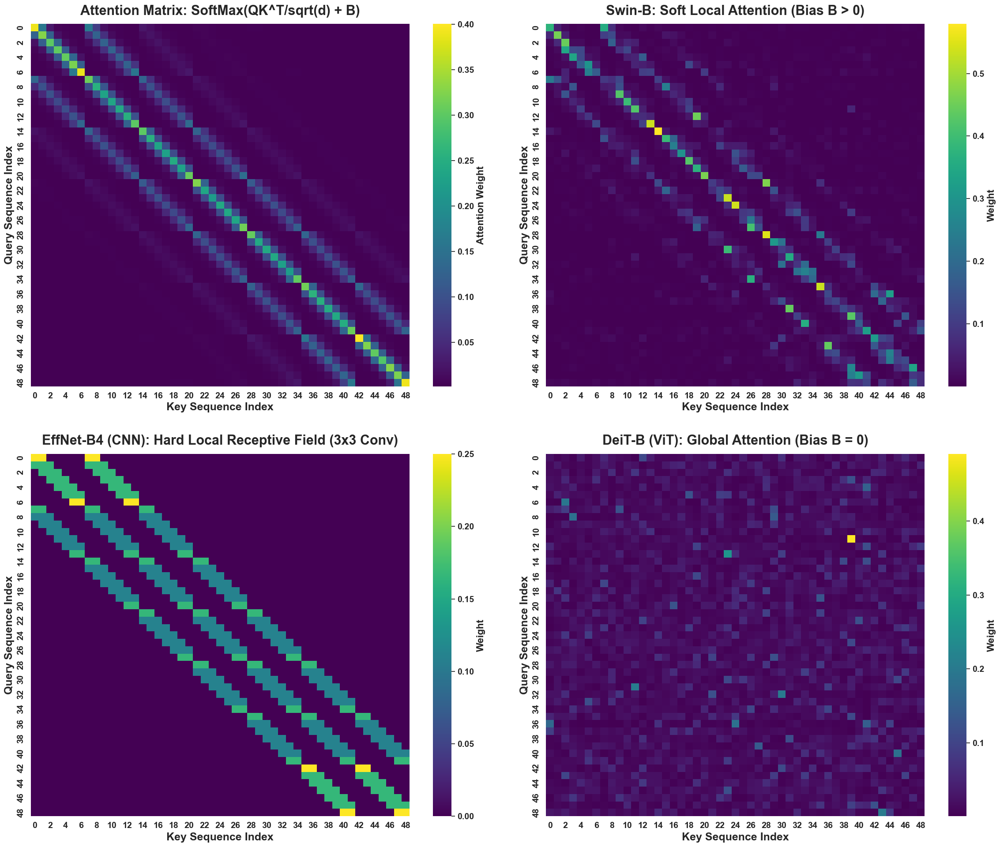
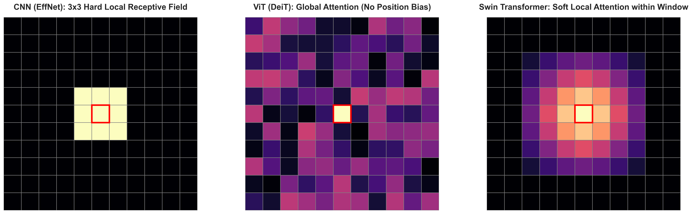
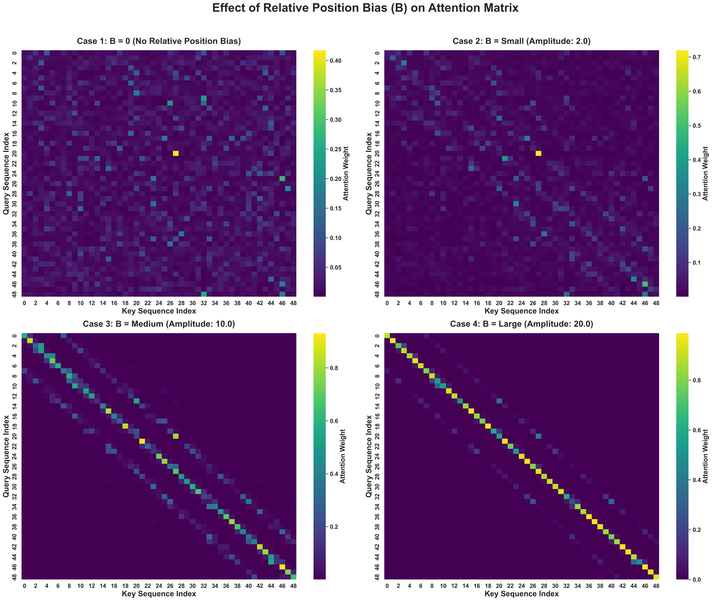
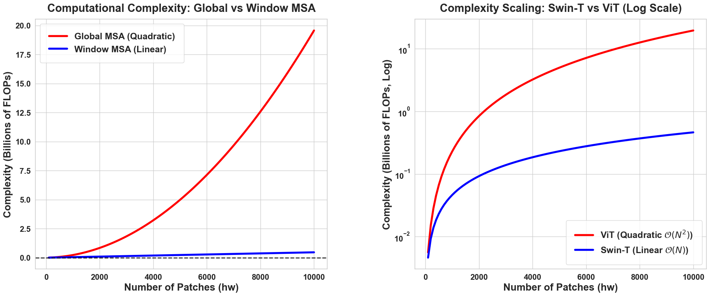
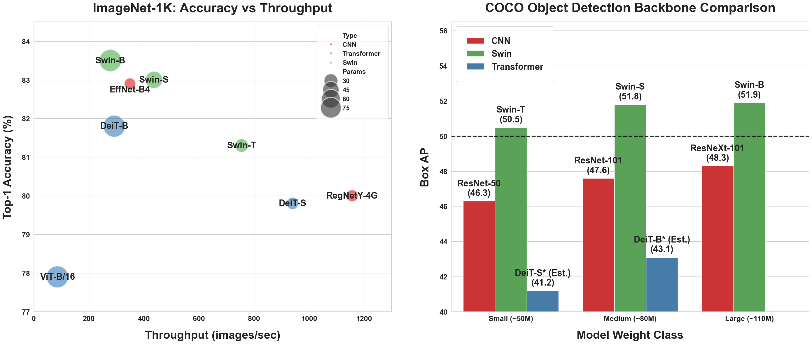

# Swin Transformer — 논문 리뷰용 추가 이미지 자료

- 논문 제목 : Swin Transformer: Hierarchical Vision Transformer using Shifted Windows
- 논문 원문: [https://arxiv.org/pdf/2103.14030](https://arxiv.org/pdf/2103.14030)
  
## KDT Team Project : 팀 Chainers 🫡
- 논문 리뷰 내용은 아래 Notion 링크를 참고해주세요.
- https://www.notion.so/Swin-Transformer-31467903c315807d94b8fbd0f7a00be2

아래 이미지들은 Swin Transformer 논문 리뷰 작성을 위해 논문 내용을 기반으로 정리하거나 실험용으로 시도한 보충 시각화 자료를 포함합니다.

시각화 코드는 `doit_figures.ipynb`에 수록되어 있으며, Image_Data 폴더에 실험용 예제 이미지 파일이 2개 있습니다.

VScode 또는 구글 Colab으로 실행하면 이미지 파일들이 생성됩니다.

---

### 시뮬레이션 및 테스트에 사용된 예제 이미지

| 파일명 | 설명 | 출처 |
|--------|------|------|
| `cat1.jpg` | 단순 배경의 단일 객체 이미지 (고양이). 낮은 장면 복잡도를 대표한다. | https://meeco.kr/Gallery/25535536 |
| `marathon1.jpg` | 다수의 객체와 복잡한 배경을 포함한 이미지 (2023 JTBC 서울 마라톤). 높은 장면 복잡도를 대표한다. | https://www.joongang.co.kr/article/25288576 |

---

## 1. 아키텍처 비교: 어텐션 행렬 (4×4 그리드)

- CNN(EffNet-B4), ViT(DeiT-B), Swin Transformer, 그리고 일반 Softmax 어텐션의 어텐션 행렬을 하나의 4×4 그리드로 비교한 그림이다.  
- CNN의 hard local receptive field, ViT의 position bias 없는 global attention, Swin의 soft local attention(B > 0) 간의 구조적 차이를 attention weight 분포로 확인할 수 있다.

---

## 2. 모델별 수용 영역(Receptive Field) 비교

- 단일 쿼리 패치를 기준으로 CNN, ViT(DeiT), Swin Transformer 각각의 수용 영역을 시각화한 그림이다.  
- CNN은 3×3 conv 기반의 hard local 영역만 참조하며, ViT는 전체 패치에 걸쳐 균등하지 않은 global attention을 수행한다. Swin은 윈도우 내에서 상대적 위치 편향에 따른 soft local attention을 보인다.

---

## 3. 상대적 위치 편향(B)의 효과: 어텐션 행렬 변화

- 상대적 위치 편향(Relative Position Bias, B)의 크기를 0에서 20까지 4단계로 변화시키면서 어텐션 행렬이 어떻게 달라지는지를 보여주는 그림이다.  
- B = 0일 때는 전체 패치에 걸친 분산된 attention이 나타나며, B가 증가할수록 대각선 인근, 즉 공간적으로 인접한 패치에 attention이 집중됨을 확인할 수 있다.

---

## 4. Swin Transformer 학습 동역학: Cat vs. Marathon 이미지

- 단순 이미지(cat1.jpg)와 복잡 이미지(marathon1.jpg)를 각각 입력으로 사용했을 때의 학습 동역학을 비교한 그림이다.  
- 왼쪽 그래프는 에폭에 따른 오류율 감소, 가운데는 Bias(B) 수렴 과정, 오른쪽은 B-오류율 공간에서의 학습 궤적을 나타낸다.  
- 복잡 이미지(Marathon)는 더 높은 B 값(14.0)으로 수렴하며, 단순 이미지(Cat)는 낮은 B 값(5.0)으로 수렴함을 보인다.

---

## 5. 수학적 구조 시각화: Window MSA vs. Global MSA

- Swin Transformer의 핵심 수식인 `Attention = SoftMax(QK^T/sqrt(d) + B)V`에서 각 구성 요소의 역할을 시각화한 그림이다.  
- Window MSA와 Global MSA의 계산 구조 차이 및 상대적 위치 편향 행렬 B의 형태를 함께 도식화하였다.

---

## 6. 벤치마크 비교: ImageNet-1K 및 COCO Object Detection

- ImageNet-1K Top-1 Accuracy vs. Throughput(images/sec) 산점도와 COCO Object Detection Box AP 비교 막대 그래프를 함께 나타낸 그림이다.  
- Swin 계열 모델은 CNN 및 ViT 계열 대비 유사한 파라미터 수에서 더 높은 정확도와 검출 성능을 달성함을 보여준다.

---

## 7. 실제 이미지 기반 고충실도 벤치마크: Swin vs. ViT

- 실제 이미지(cat1.jpg: 672×448, marathon1.jpg: 560×336)를 입력으로 하여 Swin과 ViT의 어텐션 행렬, FLOPs/패치, 처리 속도(FPS), 인식 정확도를 비교한 그림이다.  
- 상단에는 입력 이미지에 윈도우 분할 방식(W-MSA: 빨간 실선, SW-MSA: 파란 점선)과 어텐션 행렬이 함께 시각화되어 있으며, 하단에는 FLOPs 스케일링 곡선(O(N) vs O(N²)) 및 정량적 지표 비교가 포함되어 있다.  
- Swin은 ViT 대비 FLOPs를 크게 줄이면서도 더 높은 인식 정확도를 달성하며, 복잡 이미지(Marathon)에서 FLOPs 격차가 더 두드러진다.

---

## 저작권

본 저장소에 포함된 코드(`doit_figures.ipynb`) 및 모든 이미지 결과물은 저작권법에 의해 보호됩니다.

저작권자의 명시적 허가 없이 본 자료의 전부 또는 일부를 복제, 배포, 수정, 상업적으로 이용하는 행위를 금합니다.

© 2026. All rights reserved.  
Contact : sjowun@gmail.com

---
